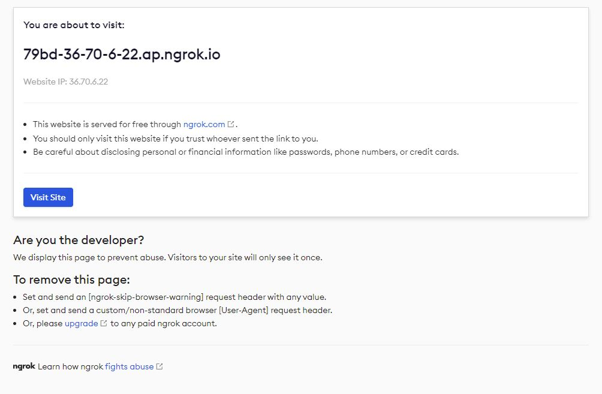

### Ringkasan

ngrok memungkinkan Anda untuk menampilkan web server berjalan di localhost anda ke internet.
Misalnya kita ingin melihat tampilan ponsel situs hugo yang sedang kita kembangkan di pc, kita bisa menggunakan Ngrok ini.

[Klik tautan ini untuk informasi mengenai Ngrok](https://ngrok.com/docs).

### Instalasi
masuk ke direktori anda, dan unduh file .zip dari ngrok.


cd $HOME/src
wget https://bin.equinox.io/c/bNyj1mQVY4c/ngrok-v3-stable-linux-amd64.tgz


Jika kebetulan link unduh telah berubah, silahkan buka [halaman unduh ngrok](https://ngrok.com/download) dan salin link file .zip untuk linux.

Buka file .zip tersebut.

sudo tar xvzf $HOME/src/ngrok-v3-stable-linux-amd64.tgz -C /usr/local/bin


Jika anda belum menginstal unzip, Anda dapat melakukannya seperti ini:


sudo apt install unzip



ngrok http 80


Untuk token, anda bisa mendapatkannya di web ngrok - https://dashboard.ngrok.com/signup

jika Anda memasukkan perintah ini ./ngrok Anda akan melihat output ini


NAME:
  ngrok - tunnel local ports to public URLs and inspect traffic

USAGE:
  ngrok [command] [flags]

DESCRIPTION:
  ngrok exposes local networked services behinds NATs and firewalls to the
  public internet over a secure tunnel. Share local websites, build/test
  webhook consumers and self-host personal services.
  Detailed help for each command is available with 'ngrok help <command>'.
  Open http://localhost:4040 for ngrok's web interface to inspect traffic.

Author:
  ngrok - <support@ngrok.com>

TERMS OF SERVICE: https://ngrok.com/tos

EXAMPLES:
  ngrok http 80                    # secure public URL for port 80 web server
  ngrok http --subdomain=baz 8080  # port 8080 available at baz.ngrok.io
  ngrok http foo.dev:80            # tunnel to host:port instead of localhost
  ngrok http https://localhost     # expose a local https server
  ngrok tcp 22                     # tunnel arbitrary TCP traffic to port 22
  ngrok tls --hostname=foo.com 443 # TLS traffic for foo.com to port 443
  ngrok start foo bar baz          # start tunnels from the configuration file

COMMANDS:
  api                            use ngrok agent as an api client
  completion                     generates shell completion code for bash or zsh
  config                         update or migrate ngrok's configuration file
  credits                        prints author and licensing information
  diagnose                       diagnose connection issues
  help                           Help about any command
  http                           start an HTTP tunnel
  service                        run and control an ngrok service on a target operating system
  start                          start tunnels by name from the configuration file
  tcp                            start a TCP tunnel
  tls                            start a TLS tunnel
  tunnel                         start a tunnel for use with a tunnel-group backend
  update                         update ngrok to the latest version
  version                        print the version string

OPTIONS:
  -h, --help      help for ngrok
  -v, --version   version for ngrok


ini berarti ngrok bekerja dengan baik

Sekarang yang perlu Anda lakukan adalah menentukan port tempat situs web Anda di-server sehingga Anda mengeksposnya ke internet.\n
Misalnya saya ingin menampilkan situs saya yang menggunakan Hugo. Hugo menggunakan port 1313.


ngrok http 1313


&nbsp;


Session Status                online
Account                       Andre Moreno (Plan: Free)
Version                       3.0.6
Region                        Asia Pacific (ap)
Latency                       32ms
Web Interface                 http://127.0.0.1:4040
Forwarding                    https://d102-36-70-6-22.ap.ngrok.io -> http://localhost:1313
Connections                   ttl     opn     rt1     rt5     p50     p90
                              0       0       0.00    0.00    0.00    0.00


&nbsp;

Lalu kita bisa menggunakan url yang ada di output tersebut diatas untuk memunculkan situs local di internet.


hugo serve -D --debug -b https://d102-36-70-6-22.ap.ngrok.io --appendPort=false

#atau hanya dengan

hugo server -D


&nbsp;

Jadi kita sudah bisa menyiasati port 1313 dan localhost. Anda dapat dengan leluasa mengembangkan situs anda dalam mode ini, tetapi harap diingat bahwa ngrok digunakan oleh saya ini di tingkat gratis dan dapat tunduk pada batasan atau masalah privasi.

Saat pertama kali kita mengakses tautan dari ngrok tersebut, kita akan melihat halaman seperti ini, dan kita hanya perlu klik "Visit Site".

