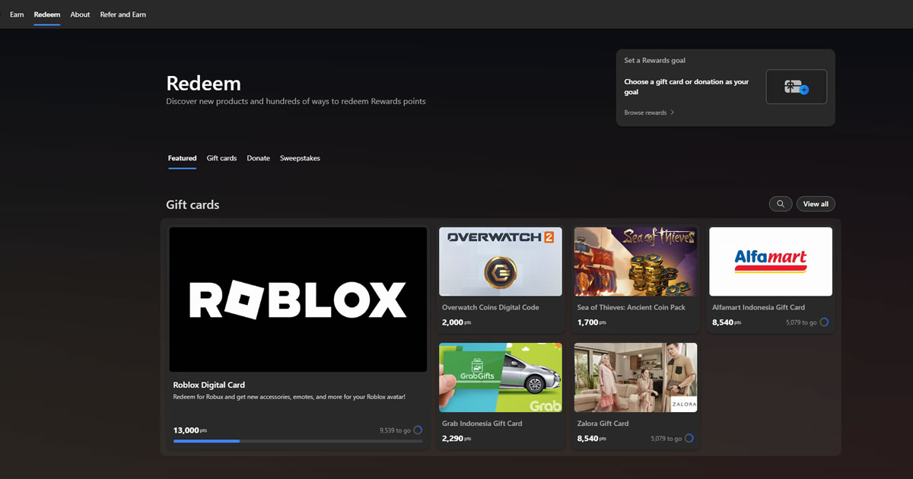

Kalau kamu sering pakai Bing, mungkin kamu sudah pernah lihat program poin dari Microsoft yang sering disebut Bing Rewards. Secara resmi, program ini bernama Microsoft Rewards, tapi banyak orang tetap memakai istilah Bing Rewards karena akses utamanya memang lewat Bing.

Lewat program ini, kamu bisa mengumpulkan poin dari aktivitas harian seperti search di Bing, membuka Microsoft Edge, atau menyelesaikan misi tertentu. Poin yang terkumpul nanti bisa ditukar dengan hadiah digital yang tersedia sesuai region masing-masing.

## Apa itu Bing Rewards?

Bing Rewards adalah program loyalitas dari Microsoft yang memberi poin kepada pengguna yang aktif di ekosistem mereka. Kamu hanya perlu login dengan akun Microsoft untuk mulai ikut program ini.

Beberapa cara untuk mendapatkan poin antara lain:

- Mencari informasi di Bing Search.
- Menyelesaikan Daily Set.
- Menjalankan tugas harian atau promo tertentu.
- Menggunakan Bing dan Microsoft Edge secara rutin.
- Mengecek halaman redeem untuk hadiah yang tersedia di region kamu.

Kalau dilakukan setiap hari, poinnya bisa terkumpul cukup cepat.

## Hadiah yang Tersedia di Indonesia

Ketersediaan hadiah bisa berbeda tergantung region. Untuk Indonesia, beberapa contoh gift card yang tersedia untuk ditukar dengan poin adalah:

- Roblox Digital Card.
- Overwatch Coins Digital Code.
- Sea of Thieves: Ancient Coin Pack.
- Alfamart Indonesia Gift Card.
- Grab Indonesia Gift Card.
- Zalora Gift Card.

> Catatan: daftar hadiah bisa berubah sewaktu-waktu sesuai kebijakan Microsoft dan ketersediaan region.

## Cara Bergabung

Bergabung ke Bing Rewards gratis. Kamu hanya butuh akun Microsoft yang aktif.

Silakan daftar lewat tautan berikut:

[Daftar Bing Rewards Sekarang](https://dre.web.id/mrp)

Setelah login, kamu bisa mulai mengumpulkan poin dari aktivitas harian dan cek hadiah yang tersedia di halaman redeem.

## Tips Cepat Mengumpulkan Poin

- Gunakan Bing sebagai mesin pencari utama.
- Buka Microsoft Edge untuk browsing harian.
- Selesaikan Daily Set setiap hari.
- Cek halaman Rewards secara rutin untuk bonus tambahan.
- Pantau hadiah yang sedang tersedia di region Indonesia.

Kebiasaan kecil yang dilakukan secara konsisten bisa membantu poin terkumpul lebih cepat.

## Penutup

Bing Rewards atau Microsoft Rewards bisa jadi cara simpel untuk mendapatkan hadiah digital tanpa modal. Selama kamu aktif dan rutin menyelesaikan tugas harian, poin bisa terus bertambah dan ditukar dengan gift card yang tersedia di Indonesia.

[Daftar Bing Rewards di Sini](https://dre.web.id/mrp)